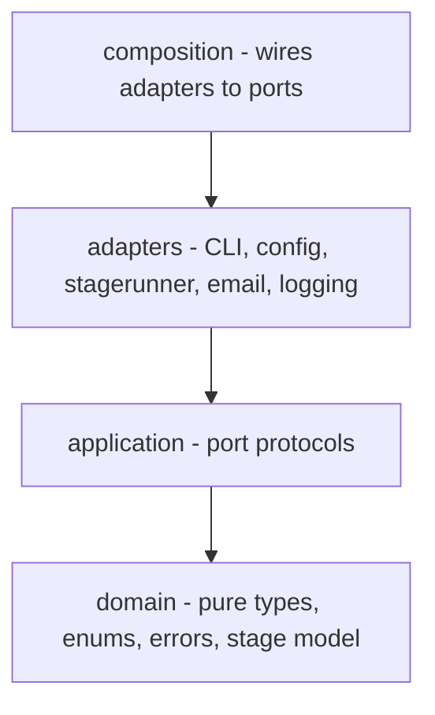
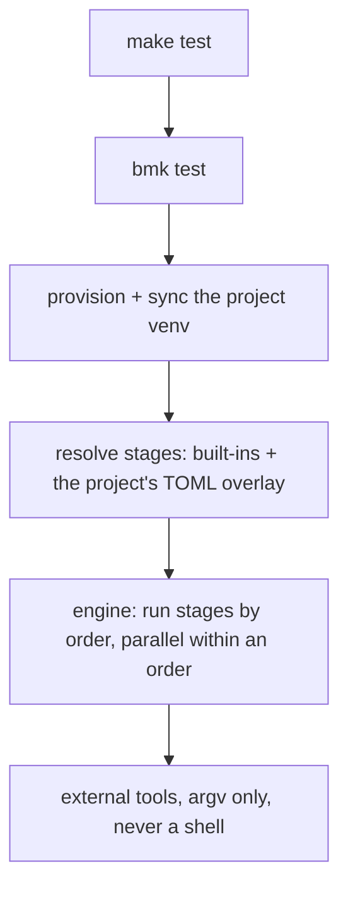

# System Documentation: bmk

> Architecture level only. WHY, and how the parts fit. The code owns the HOW.

## Status

Complete.

## Purpose (Why)

A Python project needs the same dozen chores in every repo: format, lint, type-check, audit,
test, bump, tag, release. `make` is the right front door for them - it is everywhere, and it
gives a newcomer one thing to type. What rots is the inside: a make recipe is a string handed
to a shell, so the chores end up as hundreds of lines of bash, per repo, drifting apart, and
breaking differently on Windows.

bmk keeps the front door and replaces what is behind it. The Makefile becomes a thin,
versioned wrapper that delegates to a Python runner, so the same `make test` behaves
identically on Linux, macOS and Windows, and no repo has a shell script to maintain.

## Context

bmk drives a project it does not belong to. It reads that project's `pyproject.toml`,
provisions the project's virtualenv with uv, and runs external tools (ruff, pyright, bandit,
pip-audit, import-linter, pytest, shellcheck, PSScriptAnalyzer) against it, then talks to git,
GitHub and PyPI to cut a release. It ships the Makefile that invokes it.

## Architecture

**Where it fits:** a CLI application in clean-architecture layers. bmk is consumed as a tool
rather than as a library - it exposes only a small public surface (`get_config`,
`print_info`), and a project talks to it through `make`, not through imports.

**Layers** (enforced by import-linter contracts, not convention):

Dependencies point inward only, and the domain imports neither adapters nor composition. The
contracts fail the build, so this is a fact rather than an aspiration.

**Main components:**

| Component             | Responsibility (one line)                                                                |
|-----------------------|------------------------------------------------------------------------------------------|
| domain                | The vocabulary: what a stage and a pipeline are, the enums, the errors. No I/O.          |
| application           | The port protocols an adapter must satisfy.                                              |
| stagerunner           | Resolves a command into ordered stages and runs them; owns the environment they run in.  |
| stagerunner/registry  | Which stages make up which pipeline, and at what order.                                  |
| stagerunner/overrides | Lets a project add, remove or replace stages from TOML.                                  |
| stagerunner/venv      | Provisions and syncs the project's own venv, and keeps it out of git and the type-check. |
| stagerunner/tools     | Turns a stage into an argv list for an external tool.                                    |
| cli                   | The rich-click surface; one command per pipeline.                                        |
| config                | Layered configuration, deployment and display.                                           |
| memory                | In-memory adapters, shipped in src so consumers can test against them (see ADR 0001).    |
| composition           | Wires the adapters to the ports.                                                         |
| makefile              | The template bmk installs into a project, and re-installs when it updates.               |

**How a command runs:**

## Key Decisions (Why this way)

- **Decision:** the runner is Python, not shell. **Why:** the same code path then runs on
  every OS, so behaviour cannot diverge between a bash and a PowerShell variant of the same
  stage. **Trade-off:** a Python process to start before any work happens.

- **Decision:** every stage is an argv list; `shell=True` appears nowhere. **Why:** a shell
  re-parses whatever it is handed, so data becomes code - punctuation in a commit message was
  enough to truncate and push the wrong one. **Trade-off:** no shell conveniences (globbing,
  pipelines) inside a stage; a stage that wants them must ask for them explicitly.

- **Decision:** bmk's environment holds bmk's toolchain and nothing of the project's; the
  project's dependencies live in the project's own venv, and that is what the tests, the
  type-checker and the audit all run against. **Why:** see ADR 0002 - while the two resolved
  together, a project dependency could silently backtrack bmk to an ancient release, a yanked
  transitive could stop bmk installing at all, and the suite ran in an environment neither the
  type-checker nor the audit inspected. **Trade-off:** the project must declare its own test
  tooling.

- **Decision:** stages are grouped by an order number; stages sharing an order run in
  parallel. **Why:** the independent checks (lint, types, security, tests) are the slow ones
  and do not need each other. **Trade-off:** parallel stages cannot share stdout, so their
  output is captured and replayed.

- **Decision:** JSON output by default; capture tool output and show it only when a stage
  fails. **Why:** a passing gate should be one line, and a failing one should be the only
  thing on screen. **Trade-off:** an interactive user has to ask for `--human`.

- **Decision:** a project extends a pipeline through a TOML overlay, not by dropping in a
  script. **Why:** the previous script-override mechanism meant every project maintained
  shell again, which is the problem bmk exists to remove. **Trade-off:** an overlay can only
  compose stages; anything genuinely novel belongs in a tool the stage calls.

- **Decision:** the Makefile is a versioned template that regenerates itself. **Why:** a
  copy-pasted Makefile drifts per repo, and a fix then has to be applied by hand everywhere.
  **Trade-off:** local edits to it are overwritten, so a project that needs its own must opt
  out by removing the version marker.

## Dependencies

uv (required - there is no pip fallback), git, and the GitHub CLI for release gating.
Internally: rich-click and click, pydantic, orjson, rtoml and tomlkit, httpx2,
python-dotenv, and the bitranox libraries lib_cli_exit_tools, lib_log_rich,
lib_layered_config and btx_lib_mail. The gate tools it drives are listed in Context.

## Links

- [ADR 0001](../adr/0001-memory-adapters-in-src.md) - in-memory adapters in src
- [ADR 0002](../adr/0002-bmk-env-holds-bmk-alone.md) - bmk's env holds bmk alone, and is shared
- [pyproject reference](../pyproject-reference.md) - what bmk reads from a project
- [CLI reference](../cli-reference.md) - the commands themselves
